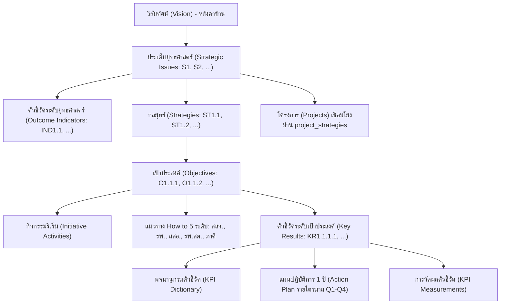
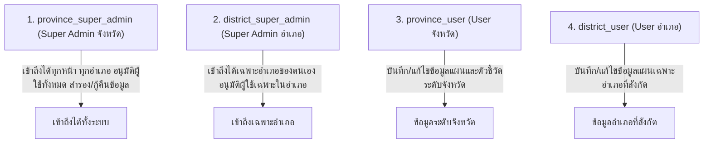

# เอกสารสถาปัตยกรรมและรายละเอียดระบบ (System Documentation & Architecture)
## ระบบบริหารจัดการแผนยุทธศาสตร์สุขภาพ 5 ปี และแผนปฏิบัติการ 1 ปี (Strategic SKO)
### สำนักงานสาธารณสุขจังหวัดสระแก้ว (พ.ศ. 2570 – 2574)

> **บันทึกสำหรับ AI Agent ในการเริ่มเซสชันใหม่:**  
> ไฟล์นี้คือคู่มือสรุปบริบทและรายละเอียดทางเทคนิคทั้งหมดของโปรเจกต์นี้ เมื่อขึ้นแชทใหม่หรือต้องการพัฒนาต่อ ให้อ่านไฟล์นี้เป็นลำดับแรกเพื่อทำความเข้าใจระบบ โครงสร้างฐานข้อมูล ความสัมพันธ์ของข้อมูล และเงื่อนไขทางธุรกิจ (Business Rules) ทั้งหมด โดยสามารถอัปเดตไฟล์นี้เพิ่มเติมได้เมื่อระบบมีการพัฒนาเปลี่ยนแปลง

---

## สารบัญ (Table of Contents)
1. [ภาพรวมของระบบและวัตถุประสงค์ (System Overview)](#1-ภาพรวมของระบบและวัตถุประสงค์-system-overview)
2. [เทคโนโลยีและเครื่องมือหลัก (Technology Stack)](#2-เทคโนโลยีและเครื่องมือหลัก-technology-stack)
3. [โครงสร้างและลำดับชั้นแผนยุทธศาสตร์ (Strategic Hierarchy & Data Model)](#3-โครงสร้างและลำดับชั้นแผนยุทธศาสตร์-strategic-hierarchy--data-model)
4. [โครงสร้างฐานข้อมูล (Database Schema & Tables)](#4-โครงสร้างฐานข้อมูล-database-schema--tables)
5. [ระบบพจนานุกรมและการวัดผลตัวชี้วัด (KPI Dictionary & Measurements)](#5-ระบบพจนานุกรมและการวัดผลตัวชี้วัด-kpi-dictionary--measurements)
6. [ระบบสิทธิ์และการยืนยันตัวตน (Authentication & RBAC)](#6-ระบบสิทธิ์และการยืนยันตัวตน-authentication--rbac)
7. [ขอบเขตพื้นที่และกลุ่มงาน (Geographical Scope & Work Groups)](#7-ขอบเขตพื้นที่และกลุ่มงาน-geographical-scope--work-groups)
8. [ฟังก์ชันอัจฉริยะและการผสาน AI (Gemini AI Integration)](#8-ฟังก์ชันอัจฉริยะและการผสาน-ai-gemini-ai-integration)
9. [ฟังก์ชันพิเศษอื่นๆ (Special Features & Utilities)](#9-ฟังก์ชันพิเศษอื่นๆ-special-features--utilities)
10. [แผนผังไฟล์และโค้ดของระบบ (Source Code Structure)](#10-แผนผังไฟล์และโค้ดของระบบ-source-code-structure)
11. [แนวทางการดูแลและพัฒนาต่อ (Development & Maintenance Guidelines)](#11-แนวทางการดูแลและพัฒนาต่อ-development--maintenance-guidelines)

---

## 1. ภาพรวมของระบบและวัตถุประสงค์ (System Overview)

ระบบ **Strategic SKO** ถูกพัฒนาขึ้นเพื่อเป็นแพลตฟอร์มกลางในการจัดทำ กำกับ ติดตาม และประเมินผลแผนยุทธศาสตร์สุขภาพ 5 ปี (พ.ศ. 2570 – 2574) รวมถึงแผนปฏิบัติการประจำปี (Action Plan รายไตรมาส Q1–Q4) ของสำนักงานสาธารณสุขจังหวัดสระแก้ว และเครือข่ายบริการสุขภาพระดับอำเภอทั้ง 9 อำเภอ

### วัตถุประสงค์หลัก
1. **จัดทำและบริหารโครงสร้างยุทธศาสตร์แบบเชื่อมโยง:** รวบรวม วิสัยทัศน์, พันธกิจ, เป้าประสงค์สูงสุด, SWOT/TOWS, ประเด็นยุทธศาสตร์, กลยุทธ์, เป้าประสงค์, ตัวชี้วัด (KPI / Key Result) และโครงการ
2. **บริหารจัดการข้อมูลแบบกระจายศูนย์ (Multi-District Scoping):** รองรับการดูและการจัดการข้อมูลทั้งในระดับจังหวัด (สสจ.) และระดับอำเภอ (9 อำเภอ) โดยมีระบบสิทธิ์ควบคุมการเข้าถึง
3. **กำกับติดตามตัวชี้วัดแบบรอบด้าน (KPI Monitoring Dashboard):** แสดงผลเปรียบเทียบผลงานระดับจังหวัดและรายอำเภอผ่านกราฟและตัวชี้วัด พร้อมเปรียบเทียบกับค่าเป้าหมายและเกณฑ์เตือนภัย
4. **พจนานุกรมตัวชี้วัดมาตรฐาน (KPI Dictionary):** มีคำอธิบายตัวชี้วัด ตัวตั้ง ตัวหาร เกณฑ์นับเข้า/ออก แหล่งข้อมูล ความถี่ และมี AI ช่วยสร้างข้อมูลอัตโนมัติ
5. **การพิมพ์เล่มรายงานและส่งออกข้อมูล (Reporting & Exporting):** รองรับการส่งออกเป็นไฟล์ Excel ครบทุกมิติ และมีหน้าจัดพิมพ์รูปเล่มรายงานมาตรฐาน (Print Book) ที่พร้อมพิมพ์เป็นเอกสารหรือบันทึกเป็น PDF ทันที

---

## 2. เทคโนโลยีและเครื่องมือหลัก (Technology Stack)

| องค์ประกอบ | เทคโนโลยีที่เลือกใช้ | รายละเอียด |
|---|---|---|
| **Frontend Framework** | **Next.js 16.3.1 (App Router)** | ใช้ Server Components ควบคู่กับ Client Components ตามความเหมาะสม |
| **UI Library** | **React 19.2.8** | รองรับการทำงานล่าสุด |
| **Language** | **TypeScript 5** | Type-safe ตลอดทั้งโปรเจกต์ |
| **Database & Auth** | **Supabase (PostgreSQL 15+)** | บริหารจัดการฐานข้อมูล, Supabase Auth, Row-Level Security (RLS) และ Realtime Channels |
| **Supabase Client Strategy** | `@supabase/ssr` + Singleton | ใช้คุกกี้เซสชันผ่าน Middleware ป้องกันปัญหา Instance ซ้ำซ้อนและปัญหาสิทธิ์ RLS |
| **AI Integration** | **Google Gemini API** (`@google/genai`) | ใช้โมเดล `gemini-3.5-flash-lite` ในการ Auto-generate พจนานุกรมตัวชี้วัด (KPI Dictionary) แบบ JSON |
| **Data Visualization** | **Recharts 3.10.1** | ทำกราฟแท่งเปรียบเทียบผลงาน KPI รายอำเภอ พร้อม Reference Line เส้นเป้าหมายและเส้นเตือน |
| **Excel Export** | **SheetJS (xlsx 0.18.5)** | ดึงโครงสร้างแผนแบบ Hierarchy แล้วแปลงเป็นตาราง Excel แบบหลายมิติ |
| **Styling** | **Pure CSS Variables + Bento Grid** | ออกแบบธีมสะอาด ทันสมัย ใน `globals.css` ไม่พึ่ง CSS Framework ภายนอก ทำให้โหลดไวและควบคุมง่าย |
| **Icons** | **lucide-react** | ชุดไอคอน UI ทั้งหมด |

---

## 3. โครงสร้างและลำดับชั้นแผนยุทธศาสตร์ (Strategic Hierarchy & Data Model)

ระบบออกแบบตามโมเดลบ้านยุทธศาสตร์ (Strategic House Model) และกรอบการวางแผนยุทธศาสตร์สาธารณสุข:



### รูปแบบรหัสกำกับอัตโนมัติ (Auto-ID Convention)
ระบบมีฟังก์ชัน **Cascade Auto-Renumbering** ช่วยจัดเรียงและตั้งรหัสให้อัตโนมัติเมื่อมีการเพิ่ม ย้าย หรือลบ:
- **ประเด็นยุทธศาสตร์ (Strategic Issue):** `S1`, `S2`, `S3`, `S4`, ...
- **ตัวชี้วัดระดับยุทธศาสตร์ (Outcome Indicator):** `IND1.1`, `IND1.2`, ... (ผูกตรงกับ Strategic Issue)
- **กลยุทธ์ (Strategy):** `ST1.1`, `ST1.2`, ...
- **เป้าประสงค์ (Objective):** `O1.1.1`, `O1.1.2`, ...
- **ตัวชี้วัดระดับเป้าประสงค์ (Key Result / KPI):** `KR1.1.1.1`, `KR1.1.1.2`, ...
- **แผนปฏิบัติการรายไตรมาส (Action Plan Measurement):** `KR1.1.1.1-Q1.1`, `KR1.1.1.1-Q2.1`, ...

### แนวทางปฏิบัติ How to 5 ระดับ (5-Tier Health System Delivery)
ในทุกเป้าประสงค์ (`objectives`) จะมีช่องให้กำหนดแนวทางการขับเคลื่อนตามบทบาทของเครือข่ายบริการสุขภาพ:
1. `ia_ssjj`: สำนักงานสาธารณสุขจังหวัด (สสจ.)
2. `ia_rph`: โรงพยาบาลศูนย์ / โรงพยาบาลทั่วไป / โรงพยาบาลชุมชน (รพ.)
3. `ia_ssor`: สำนักงานสาธารณสุขอำเภอ (สสอ.)
4. `ia_rphst`: โรงพยาบาลส่งเสริมสุขภาพตำบล (รพ.สต.)
5. `ia_phakee`: ภาคีเครือข่ายภายนอก (อปท., อสม., ชุมชน, ส่วนราชการอื่น)

---

## 4. โครงสร้างฐานข้อมูล (Database Schema & Tables)

### ตารางหลักในระบบ (Supabase Tables)

| ชื่อตาราง | คำอธิบาย | ฟิลด์สำคัญ |
|---|---|---|
| `districts` | ตารางข้อมูลอำเภอและจังหวัด | `id`, `name`, `type` (`province` หรือ `district`) |
| `profiles` | ข้อมูลผู้ใช้งานที่ผูกกับ `auth.users` | `id` (FK auth.users), `first_name`, `last_name`, `role`, `work_group`, `approval_status`, `district_id` (FK districts) |
| `core_organization` | ข้อมูลองค์กรระดับบน | `id`, `district_id`, `vision`, `mission`, `ultimate_goal` |
| `core_list_items` | รายการพันธกิจและเป้าประสงค์สูงสุด | `id`, `district_id`, `item_type` (`mission`/`goal`), `detail`, `created_at` |
| `swot_items` | รายการวิเคราะห์ SWOT/TOWS | `id`, `district_id`, `swot_type` (`S`, `W`, `O`, `T`), `detail` |
| `strategic_issues` | ประเด็นยุทธศาสตร์หลัก | `id`, `district_id`, `auto_id`, `name`, `theme_color`, `order_index` |
| `strategies` | กลยุทธ์ภายใต้ประเด็นยุทธศาสตร์ | `id`, `strategic_issue_id` (FK), `auto_id`, `name`, `order_index` |
| `objectives` | เป้าประสงค์ภายใต้กลยุทธ์ | `id`, `strategy_id` (FK), `auto_id`, `name`, `initiative_activity` (JSON), `ia_ssjj`, `ia_rph`, `ia_ssor`, `ia_rphst`, `ia_phakee`, `order_index` |
| `key_results` | ตัวชี้วัด (ทั้งระดับยุทธศาสตร์และเป้าประสงค์) | `id`, `district_id`, `strategic_issue_id` (สำหรับ IND), `objective_id` (สำหรับ KR), `auto_id`, `name`, `responsible_group`, `measurement_status`, `target_2570` ถึง `target_2574`, `order_index` |
| `projects` | โครงการ | `id`, `district_id`, `strategic_issue_id` (FK), `name`, `description`, `responsible_group`, `budget`, `order_index` |
| `project_strategies` | ตาราง Many-to-Many ระหว่างโครงการและกลยุทธ์ | `project_id`, `strategy_id` |
| `kpi_dictionaries` | ข้อมูลพจนานุกรมและตั้งค่าการวัดผลตัวชี้วัด | `id`, `key_result_id` (FK key_results หรือ null สำหรับ standalone), `kpi_name`, `kpi_type`, `definition`, `numerator`, `denominator`, `inclusion_criteria`, `exclusion_criteria`, `data_source`, `data_collection_method`, `frequency`, `cutoff_date`, `responsible_person`, `work_group`, `measurement_level`, `calculation_type`, `calculation_formula`, `data_items_json`, `target_operator`, `evaluation_criteria_json`, `api_enabled`, `api_config_json` |
| `kpi_tags` | ป้ายกำกับตัวชี้วัด (Tag) | `id`, `name` |
| `key_result_tags` | ความสัมพันธ์ Many-to-Many ระหว่าง KR กับ Tag | `key_result_id`, `tag_id` |
| `kpi_measurements` | ข้อมูลผลการวัดผลตัวชี้วัดรายไตรมาส/พื้นที่ | `id`, `key_result_id` (FK), `period` (`Q1`-`Q4`), `area_id` (`province` หรือ ชื่ออำเภอ), `values_json`, `result_value`, `updated_by` |
| `action_plan_measurements` | แผนปฏิบัติการรายไตรมาสภายใต้ KR | `id`, `district_id`, `key_result_id`, `quarter` (1-4), `auto_id`, `kpi_name`, `target_value`, `order_index` |

---

## 5. ระบบพจนานุกรมและการวัดผลตัวชี้วัด (KPI Dictionary & Measurements)

### 1. หมวดหมู่และประเภทตัวชี้วัด (KPI Types & Tags)
- **ตัวชี้วัดตามยุทธศาสตร์สุขภาพ สระแก้ว (5 ปี):** ผูกตรงกับ KR ในแผนยุทธศาสตร์
- **ตัวชี้วัดกระทรวงสาธารณสุข (MOPH):** ตัวชี้วัดที่กระทรวงกำหนด
- **ตัวชี้วัดตรวจราชการฯ:** ตัวชี้วัดสำหรับรอบการตรวจราชการและนิเทศงาน
- **ตัวชี้วัดอื่นๆ / นโยบายเร่งด่วน (Standalone):** ตัวชี้วัดที่ไม่ได้อยู่ในเล่มยุทธศาสตร์ 5 ปี แต่อยากตั้งค่าติดตามผล

### 2. วิธีการคำนวณ (Calculation Types)
1. `percent` (ร้อยละ): คำนวณจากสูตร เช่น `(A/B)*100` โดยมีตัวตั้ง A และตัวหาร B
2. `count` (จำนวนนับ): ตัวเลขจำนวนผลรวม เช่น จำนวนครั้ง, จำนวนคน
3. `ratio` (อัตราส่วน): เช่น `1 : 100,000` (ตัวตั้ง A, ตัวหาร B)
4. `process_status` (เชิงกระบวนการ / ขั้นตอน): ประเมินว่าบรรลุ (success) / กำลังดำเนินการ / ไม่บรรลุ หรือบันทึกข้อความอธิบายความก้าวหน้า

### 3. ระดับการวัดผล (Measurement Level)
- `province`: วัดและรายงานผลภาพรวมในระดับจังหวัด
- `district`: ให้แต่ละอำเภอจาก 9 อำเภอบันทึกค่า แล้วระบบจะนำมาเปรียบเทียบใน Dashboard

### 4. เกณฑ์การประเมิน (Evaluation Criteria & Operators)
- ตัวดำเนินการเปรียบเทียบ (`target_operator`): `>=` (มากกว่าหรือเท่ากับ), `<=` (น้อยกว่าหรือเท่ากับ), `=` (เท่ากับ)
- ค่าเป้าหมายรายไตรมาส (`q1`, `q2`, `q3`, `q4`) และเกณฑ์เตือนภัย (`q1_warning`, ..., `q4_warning`)
- การแสดงผลตามสัญญาณไฟ:
  - 🟢 **เขียว (ผ่านเกณฑ์):** ผลงานผ่านเกณฑ์เป้าหมาย
  - 🟡 **เหลือง (เฝ้าระวัง):** ผลงานยังไม่ถึงเป้า แต่สูงกว่าเกณฑ์เตือนภัย
  - 🔴 **แดง (ตกเกณฑ์):** ผลงานต่ำกว่าเกณฑ์เตือนภัย

---

## 6. ระบบสิทธิ์และการยืนยันตัวตน (Authentication & RBAC)

ระบบใช้ Supabase Auth ร่วมกับตาราง `profiles` โดยมีสถานะการอนุมัติ (`approval_status`):
- `pending`: สมาชิกใหม่ที่เพิ่งลงทะเบียน ต้องรอแอดมินอนุมัติก่อน
- `approved`: ผ่านการอนุมัติ เข้าใช้งานระบบจัดการได้ตามสิทธิ์
- `rejected`: ถูกปฏิเสธการเข้าใช้งาน

### ลำดับสิทธิ์การใช้งาน (Roles Hierarchy)



### การควบคุมสิทธิ์ผ่าน Middleware (`src/utils/supabase/middleware.ts`)
- **Public Paths (ไม่ต้องล็อกอิน):**
  - `/` (หน้า Dashboard หลัก / Roadmap ภาพรวม)
  - `/kpi/*` (หน้า Dashboard ติดตามตัวชี้วัด และหน้ารายละเอียด KPI)
  - `/manual` (คู่มือการใช้งานระบบ)
  - `/print-book` (หน้าจัดพิมพ์เอกสารรูปเล่ม)
  - `/editor/login`, `/editor/register` (หน้าเข้าสู่ระบบและสมัครสมาชิก)
- **Pending Approval Path:**
  - หากล็อกอินแล้วแต่ `approval_status !== 'approved'` จะถูก Redirect ไปที่ `/editor/pending-approval`
- **Super Admin Only Paths:**
  - `/editor/core-data` (ข้อมูลวิสัยทัศน์/SWOT)
  - `/editor/users` (การจัดการสิทธิ์และอนุมัติผู้ใช้)
  - `/editor/admin` (สำรองและกู้คืนข้อมูล - **เฉพาะ `province_super_admin` เท่านั้น**)
- **Provincial Editor Paths:**
  - `/editor/kpi-report` (บันทึกผล KPI)
  - `/editor/kpi-template` (ตั้งค่าตัวชี้วัด)

---

## 7. ขอบเขตพื้นที่และกลุ่มงาน (Geographical Scope & Work Groups)

### 1. ขอบเขตพื้นที่ (Districts)
ระบบครอบคลุมสำนักงานสาธารณสุขจังหวัดและ 9 อำเภอในจังหวัดสระแก้ว:
1. จังหวัดสระแก้ว (ภาพรวมจังหวัด)
2. อำเภอเมืองสระแก้ว
3. อำเภอคลองหาด
4. อำเภอตาพระยา
5. อำเภอวังน้ำเย็น
6. อำเภอวัฒนานคร
7. อำเภออรัญประเทศ
8. อำเภอเขาฉกรรจ์
9. อำเภอโคกสูง
10. อำเภอวังสมบูรณ์

### 2. กลุ่มงานมาตรฐานของ สสจ.สระแก้ว (16 กลุ่มงาน)
ระบบผูกข้อมูลตัวชี้วัดและผู้ใช้งานกับ 16 กลุ่มงาน:
1. กลุ่มงานบริหารทั่วไป
2. กลุ่มงานบริหารทรัพยากรบุคคล
3. กลุ่มกฎหมาย
4. กลุ่มงานพัฒนายุทธศาสตร์สาธารณสุข
5. กลุ่มงานสุขภาพดิจิทัล
6. กลุ่มงานคุ้มครองผู้บริโภคและเภสัชสาธารณสุข
7. กลุ่มงานพัฒนาคุณภาพและรูปแบบบริการ
8. กลุ่มงานควบคุมโรคติดต่อ
9. กลุ่มงานประกันสุขภาพ
10. กลุ่มงานส่งเสริมสุขภาพ
11. กลุ่มงานทันตสาธารณสุข
12. กลุ่มงานอนามัยสิ่งแวดล้อมและอาชีวอนามัย
13. กลุ่มงานควบคุมโรคไม่ติดต่อ
14. กลุ่มงานปฐมภูมิและเครือข่ายสุขภาพ
15. กลุ่มงานการแพทย์แผนไทยและการแพทย์ทางเลือก
16. กลุ่มงานพัฒนาทรัพยากรบุคคล

---

## 8. ฟังก์ชันอัจฉริยะและการผสาน AI (Gemini AI Integration)

### การสร้างพจนานุกรมตัวชี้วัดอัตโนมัติ (AI Auto-Generate KPI Dictionary)
- **Endpoint:** `POST /api/generate-kpi`
- **Library:** `@google/genai`
- **Model:** `gemini-3.5-flash-lite` (ด้วย JSON Schema Structured Output)
- **การทำงาน:** เมื่อผู้ใช้กดปุ่มไอคอน ✨ (Sparkles) ที่ตัวชี้วัดใด ระบบจะส่งชื่อตัวชี้วัดไปยัง Gemini AI โดยให้บทบาทเป็นผู้เชี่ยวชาญด้านการวางแผนกลยุทธ์สาธารณสุขไทย แล้วตอบกลับเป็น JSON ครบทุกช่อง:
  - `definition` (นิยามเชิงปฏิบัติการ)
  - `numerator` (ตัวตั้ง)
  - `denominator` (ตัวหาร)
  - `inclusion_criteria` (เกณฑ์นับเข้า)
  - `exclusion_criteria` (เกณฑ์นับออก)
  - `data_source` (แหล่งข้อมูล)
  - `data_collection_method` (วิธีการดึงข้อมูล)
  - `frequency` (ความถี่การวัด)
  - `cutoff_date` (วันตัดข้อมูล)
  - `rationale` (เหตุผลประกอบ)
  - `risk_warning` (ข้อควรระวัง/ความเสี่ยง)
  - `prerequisite` (สิ่งที่ต้องเตรียมก่อนวัดผล)

---

## 9. ฟังก์ชันพิเศษอื่นๆ (Special Features & Utilities)

### 1. การจัดเรียงและปรับรหัสอัตโนมัติ (Cascade Auto-Renumbering)
ในหน้า `/editor/workshop` เมื่อมีการสลับลำดับ (เลื่อนขึ้น/ลง), เพิ่ม หรือลบข้อมูล ระบบจะคำนวณและปรับรหัส Auto ID ให้สอดคล้องกันทั้งโครงสร้าง (เช่น S1 -> ST1.1 -> O1.1.1 -> KR1.1.1.1) ป้องกันปัญหารหัสกระโดดหรือไม่ต่อเนื่อง

### 2. การย้ายสังกัดเป้าหมายและตัวชี้วัด (Move Objective / Move KR)
- สามารถย้าย Objective ข้าม Strategy ได้
- สามารถย้าย KR จาก Objective หนึ่งไปอีก Objective หนึ่ง หรือแปลง KR ให้กลายเป็น Outcome Indicator ของ Strategic Issue ได้

### 3. การตรวจสอบความสมบูรณ์ของแผน (Completeness / QC Dashboard)
ในหน้า `/editor/dashboard` มีระบบตรวจจับข้อมูลที่ยังไม่สมบูรณ์ (Missing Elements):
- กลยุทธ์ที่ยังไม่มีเป้าประสงค์ (Missing Objectives)
- เป้าประสงค์ที่ยังไม่มีตัวชี้วัด (Missing Key Results)
- เป้าประสงค์ที่ยังไม่มีกิจกรรมริเริ่ม (Missing Initiative Activities)
- เป้าประสงค์ที่ยังกรอก How to 5 ระดับไม่ครบ (Missing How-To)

### 4. การสำรองและกู้คืนฐานข้อมูล (Full Database Backup & Restore)
ในหน้า `/editor/admin` สามารถ Export ข้อมูลทั้งหมดในรูปแบบ JSON Snapshot เพียงคลิกเดียว และสามารถนำไฟล์ JSON ดังกล่าวมา Restore ข้อมูลทั้งหมดกลับคืนได้ทันที โดยระบบจะลบข้อมูลเดิมตามลำดับ Foreign Key แล้วใส่ชุดข้อมูลสำรองกลับเข้าไป

### 5. การส่งออก Excel (Export to Excel)
มีคอมโพเนนต์ `ExportButton.tsx` ใช้ `xlsx` แปลงข้อมูลโครงสร้างหลายมิติ (Issues -> Strategies -> Objectives -> KRs -> 4-Quarter Action Plans) ออกมาเป็นตาราง Excel ที่มีคอลัมน์ครบถ้วน พร้อมจัดความกว้างคอลัมน์ให้อ่านง่าย

### 6. หน้ารูปเล่มเอกสารพร้อมพิมพ์ (Print Book / PDF Generation)
หน้า `/print-book` ได้รับการออกแบบสไตล์เล่มรายงานทางการ มีหน้าปก, คำนำ, สารบัญ, สรุปสถิติ, โมเดลบ้านยุทธศาสตร์, SWOT, ตารางโครงสร้างแผนแยกตามประเด็นยุทธศาสตร์ และภาคผนวกพจนานุกรมตัวชี้วัด พร้อมคำสั่ง `@media print` สำหรับสั่งพิมพ์หรือเซฟเป็นไฟล์ PDF ได้ทันที

### 7. การอัปเดตข้อมูลแบบ Real-time (Supabase Realtime)
ในหน้าหลักและหน้า Action Plan มีการเปิด Realtime Subscriptions (`postgres_changes`) เพื่อให้หน้าเว็บดึงข้อมูลใหม่ทันทีเมื่อมีการแก้ไข โดยไม่ต้องกด Refresh หน้าเว็บเอง

### 8. ระบบติดตามตัวชี้วัดระดับ รพ.สต. และเชื่อมต่อ HDC Open Data (Subdistrict HDC Monitoring)
ในหน้า `/kpi/dashboard` มีแท็บ **"รพ.สต. (HDC)"** สำหรับติดตามผลการดำเนินงานระดับปฐมภูมิของ รพ.สต. ทั้ง 108 แห่งในจังหวัดสระแก้ว:
- **ข้อมูลพื้นฐานสถานบริการ:** เชื่อมโยงรหัส 5 หลักและ 9 หลัก พร้อมจัดกลุ่มตาม 9 อำเภอในสระแก้ว
- **การแสดงผล Heatmap เต็มช่องตาราง (Matrix View):** แสดงสีเขียว (ผ่านเกณฑ์), สีเหลือง (เฝ้าระวัง), สีแดง (ไม่ผ่านเกณฑ์) พร้อมเปอร์เซ็นต์และตัวเลขผลงาน/เป้าหมาย (เช่น 15/20 คน)
- **การเชื่อมต่อ HDC Open Data Web Service:** ดึงข้อมูลตรงผ่าน Web Service ของกระทรวงสาธารณสุข (`https://opendata.moph.go.th/api/report_data`) ด้วย Client-side Direct Fetch (ไอพีในประเทศ) เพื่อป้องกันปัญหา Cloudflare WAF บล็อกไอพีต่างประเทศของ Vercel
- **ระบบซิงค์ข้อมูลอัตโนมัติประจำวันรอบ 08:00 น. (Daily 08:00 AM Auto-Sync):** ตรวจสอบรอบเวลาและดึงข้อมูลอัปเดตจาก HDC อัตโนมัติในพื้นหลังเมื่อถึงเวลา 08:00 น. ของทุกวัน พร้อมแถบแสดงสถานะและปุ่มกดดึงข้อมูลสดพร้อมกันทุกตัวชี้วัด (Force Sync)
- **ระบบเพิ่มและแก้ไขตัวชี้วัด HDC:** สามารถสร้างตัวชี้วัดใหม่ หรือแก้ไขตัวชี้วัดที่มีอยู่เดิม (เปลี่ยนชื่อ, ชื่อตาราง, ปีงบประมาณ, หมวดหมู่หลัก, หมวดหมู่ย่อย, เกณฑ์เป้าหมาย และเกณฑ์เตือนภัย) พร้อมดึงข้อมูลสดใหม่ทันที
- **ระบบจัดหมวดหมู่ 2 ระดับและตัวกรอง (HDC Taxonomy & Filtering):** รองรับ 5 หมวดหมู่หลัก (การเข้าถึงบริการ, ข้อมูลตอบสนอง service plan, ข้อมูลทั่วไป, ส่งเสริมป้องกัน, สถานะสุขภาพ) และหมวดหมู่ย่อยตามโครงสร้าง HDC พร้อม Dropdown กรองแสดงผลตามหมวดหมู่หลัก/ย่อย และมี Tag Badge แสดงหมวดหมู่ในหัวตาราง
- **การแสดงผลแท็กปีงบประมาณและหมวดหมู่:** มี Badge แสดงปีงบประมาณและแท็กหมวดหมู่กำกับในหัวคอลัมน์ของทุกตัวชี้วัดอย่างชัดเจน (เช่น `[HDC-01] 📅 ปี 2569 🏷️ อนามัยแม่และเด็ก (s_anc5)`)
- **โหมดขยายเต็มจอและการตรึงหัวตาราง (Fullscreen Mode & Sticky Headers):** มีปุ่ม "⛶ ขยายเต็มจอ" (หรือกดปุ่ม Esc เพื่อย่อกลับ) ขยายตาราง Matrix ให้เต็มจอ 100vw x 100vh แสดงสีเขียว เหลือง แดง ได้สะใจ พร้อมตรึงหัวตาราง (Header Sticky Top) และตรึงคอลัมน์รหัส 5 หลัก/ชื่อ รพ.สต. (Sticky Left) ไว้อย่างมั่นคงขณะเลื่อนดูทั้งแนวตั้งและแนวนอน
- **การจัดรูปแบบชื่อ รพ.สต. ให้กระชับสบายตา:** ตัดคำว่า "ตำบล..." ที่ต่อท้ายชื่อ รพ.สต. ออกทั้งหมด เพื่อให้ตารางอ่านง่ายและกระชับ พร้อมกรณีพิเศษสำหรับ "สถานีอนามัยเฉลิมพระเกียรติ 60 พรรษา นวมินทราชินี (วังสมบูรณ์)" ให้แสดงชื่อเป็น "สอน." อย่างถูกต้องตามมาตรฐานสาธารณสุข
- **การปรับความสูงตาราง:** ปรับปรุงความสูงของตารางในโหมดปกติให้มีความสูงเพิ่มขึ้นกว่า 3 เท่าตัว (ไม่จำกัดกล่องเล็กแบบเดิม) ช่วยให้เห็นรายชื่อ รพ.สต. ได้คราวละหลายสิบแห่งพร้อมกัน
- **ตำแหน่งปุ่มเพิ่มตัวชี้วัดและโมดอลด้านบนสุด (Outermost Top-Bar Placement):** วางปุ่ม '➕ เพิ่มตัวชี้วัด HDC' และ '⛶ เต็มจอ' ไว้ที่กล่องหัวเรื่องบนสุดของหน้าจอ (Topmost Header Row) ควบคู่กับชื่อหน้า Dashboard ทำให้มองเห็นและกดเพิ่มตัวชี้วัดได้ทันทีโดยไม่ต้องเลื่อนหน้าจอหา พร้อมปรับโมดอลป๊อปอัปให้ชิดขอบบนของจอ (Top-Aligned) และย่อพรีวิวโค้ด JSON เป็นแบบเปิด-ปิดได้ เพื่อความสะดวกและไม่ล้นหน้าจอ

---

## 10. แผนผังไฟล์และโค้ดของระบบ (Source Code Structure)

```
strategicsko/
├── public/                     # Static assets และภาพประกอบ
├── src/
│   ├── app/
│   │   ├── api/
│   │   │   ├── admin/users/route.ts      # API จัดการอนุมัติและเปลี่ยน Role ผู้ใช้
│   │   │   ├── auth/login/route.ts       # API จัดการการเข้าสู่ระบบ
│   │   │   └── generate-kpi/route.ts     # Gemini AI สำหรับสร้าง KPI Dictionary
│   │   ├── editor/
│   │   │   ├── action-plan/page.tsx      # แผนปฏิบัติการ 1 ปี (รายไตรมาส Q1-Q4)
│   │   │   ├── admin/page.tsx            # สำรองและกู้คืนข้อมูล (Backup/Restore)
│   │   │   ├── core-data/page.tsx        # จัดการ Vision, Mission, Goal, SWOT
│   │   │   ├── dashboard/page.tsx        # สรุปสถิติและตรวจความสมบูรณ์ของแผน (QC)
│   │   │   ├── kpi-dictionary/page.tsx   # พจนานุกรมตัวชี้วัดและปุ่ม AI Auto-fill
│   │   │   ├── kpi-report/page.tsx       # บันทึกผลการดำเนินงาน KPI รายไตรมาส
│   │   │   ├── kpi-template/page.tsx     # ตั้งค่าสูตร เกณฑ์ และตัวชี้วัด (KPI Builder)
│   │   │   ├── login/                    # หน้าล็อกอินและ Server Action
│   │   │   ├── register/                 # หน้าสมัครสมาชิกและ Server Action
│   │   │   ├── pending-approval/page.tsx # หน้าแสดงสถานะรอแอดมินอนุมัติสิทธิ์
│   │   │   ├── users/page.tsx            # หน้าจัดการอนุมัติผู้ใช้และสิทธิ์สำหรับแอดมิน
│   │   │   ├── workshop/page.tsx         # เวิร์กช็อปแก้ไขโครงสร้างยุทธศาสตร์ 5 ปี
│   │   │   └── layout.tsx                # Layout หลักของ Editor Portal (Sidebar & Guard)
│   │   ├── kpi/
│   │   │   ├── [id]/page.tsx             # หน้ารายละเอียด KPI รายตัว (Public)
│   │   │   ├── dashboard/page.tsx        # แดชบอร์ดติดตาม KPI เปรียบเทียบอำเภอ (Public)
│   │   │   └── layout.tsx                # Layout ของส่วน KPI
│   │   ├── manual/page.tsx               # หน้าคู่มือการใช้งานระบบสำหรับผู้ใช้ (Public)
│   │   ├── print-book/page.tsx           # หน้ารูปเล่มเอกสารสำหรับพิมพ์ / ส่งออก PDF
│   │   ├── globals.css                   # Global CSS, Theme Variables, Bento Grid
│   │   ├── layout.tsx                    # Root Layout (Noto Sans Thai & Geist Fonts)
│   │   └── page.tsx                      # หน้าแรก (Public Strategic Roadmap & Bento Grid)
│   ├── components/
│   │   ├── CollapsibleSection.tsx        # กล่องยุทธศาสตร์แบบพับ/ขยายได้
│   │   ├── DistrictSelector.tsx          # ตัวเลือกสลับอำเภอ (Dropdown)
│   │   ├── EditorContext.tsx             # React Context จัดการ Session & Profile
│   │   ├── ExportButton.tsx              # ปุ่มส่งออกข้อมูลเป็น Excel และปุ่มพิมพ์เล่ม
│   │   ├── KrTableClient.tsx             # ตารางแสดง Key Result พร้อมแท็บ How to 5 ระดับ
│   │   ├── Modal.tsx                     # Popup Modal มาตรฐาน
│   │   ├── QuarterlyPlanTable.tsx        # ตารางแผนปฏิบัติการรายไตรมาส Q1-Q4
│   │   └── RealtimeRefresher.tsx         # Realtime listener สำหรับรีเฟรชหน้าหลัก
│   ├── lib/
│   │   └── supabase.ts                   # Supabase Browser Client Singleton
│   ├── utils/supabase/
│   │   ├── admin.ts                      # Supabase Service Role Client (Admin tasks)
│   │   ├── client.ts                     # Browser client creation helper
│   │   ├── middleware.ts                 # Next.js Middleware อัปเดต Cookie & Route Guards
│   │   └── server.ts                     # Supabase Server Client creation helper
│   └── middleware.ts                     # Next.js Middleware matcher entrypoint
├── kpi_final_migration.sql               # SQL Schema ล่าสุดสำหรับตาราง KPI และ Tag
├── supabase_district_upgrade.sql         # SQL สำหรับ District Scoping ใน Action Plan
├── fix_rls.sql                           # SQL ป้องกัน Recursion ใน RLS Policies
├── AGENTS.md                             # กฎและข้อกำหนดของ Next.js 16 สำหรับ Agent
├── CLAUDE.md                             # ตัวชี้ไปยังเอกสารของโปรเจกต์
└── package.json                          # รายการ Dependencies และ Scripts
```

---

## 11. แนวทางการดูแลและพัฒนาต่อ (Development & Maintenance Guidelines)

### สิ่งสำคัญที่ต้องระวังในการแก้ไขโค้ด (Critical Best Practices)
1. **Next.js 16 App Router Conventions:**
   - หน้ารองรับ Dynamic Routing บางหน้าต้องมี `export const dynamic = 'force-dynamic'` หรือเรียกใช้ `await headers()` / `await params` เพื่อป้องกันการติด Static Caching
   - ใน Next.js 16 พารามิเตอร์ `params` และ `searchParams` ใน Page Props จะเป็น Promise จำเป็นต้อง `await` ก่อนใช้งานเสมอ
2. **Supabase Client Instances:**
   - ในฝั่ง Client Component ให้ import `supabase` จาก `@/lib/supabase` เท่านั้น เพื่อหลีกเลี่ยงการสร้าง GoTrueClient หลายตัวพร้อมกัน
   - ในฝั่ง Server Component หรือ Server Action ให้ใช้ `createClient()` จาก `@/utils/supabase/server`
   - ในฝั่ง API Route ที่ต้องการสิทธิ์ระดับ Admin ข้าม RLS ให้ใช้ `getSupabaseAdmin()` จาก `@/utils/supabase/admin`
3. **การจัดการ Row-Level Security (RLS) ใน Supabase:**
   - อย่าเขียน Policy แบบ Query ตัวเองโดยตรงบนตาราง `profiles` เพราะจะเกิดปัญหา Infinite Recursion ให้ใช้ฟังก์ชัน `SECURITY DEFINER` เช่น `get_my_role()` และ `get_my_district_id()` ตามที่กำหนดไว้ใน `fix_rls.sql`
4. **ความสัมพันธ์ของรหัสลำดับชั้น (Hierarchical Integrity):**
   - เมื่อมีการเพิ่มตารางหรือฟิลด์ใหม่ที่ผูกกับ Key Results หรือ Objectives ให้ตรวจสอบเสมอว่าตารางเหล่านั้นมี Foreign Key ที่ตั้ง `ON DELETE CASCADE` เพื่อป้องกันข้อมูลตกค้างเมื่อมีการลบหรือย้ายระดับชั้น
5. **การอัปเดตไฟล์นี้เมื่อมีการแก้ไขระบบ:**
   - หากมีการเพิ่ม Table ใหม่, เพิ่ม Route หน้าใหม่, เปลี่ยนแปลง Flow การคำนวณ หรือปรับโครงสร้างสิทธิ์ ให้เข้ามาอัปเดตข้อมูลในไฟล์ `SYSTEM_DOCUMENTATION.md` นี้ทันที เพื่อให้ Agent ในเซสชันถัดไปเข้าใจการเปลี่ยนแปลงอย่างแม่นยำ

---
*เอกสารนี้จัดทำและอัปเดตล่าสุด: กันยายน 2569 / ระบบยุทธศาสตร์สุขภาพ สสจ.สระแก้ว*
